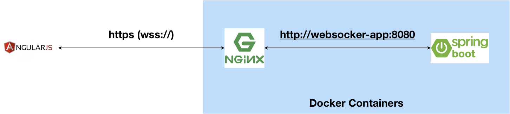
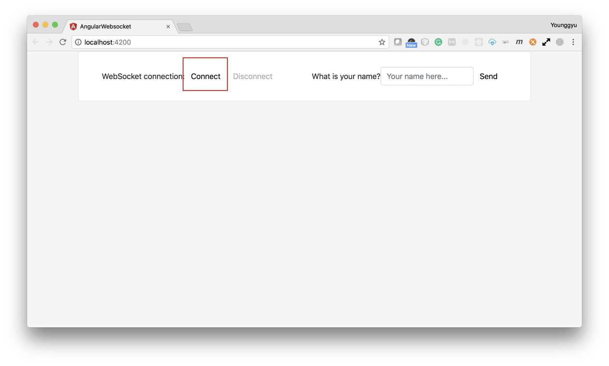
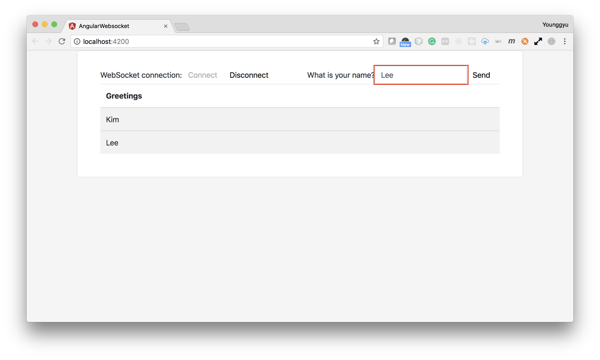
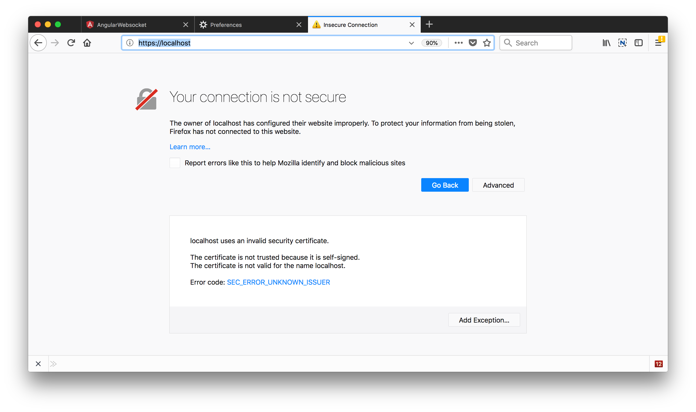
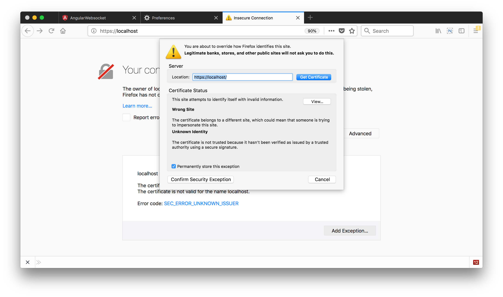

# Nginx and Websocket

---
## Introduction

This sample has three components
- Spring Boot Application(WebSocket Server)
- Nginx (SSL configured)
- Angular JS Application(WebSocket Client)


---
### Implementation



---
## How to setting up 

```sh
$ git clone https://github.com/credemol/websocket-https-nginx-springboot.git
$ cd websocket-https-nginx-springboot
```

---
### Build WebSocker Server(Spring Boot)

```sh
$ cd websocket
$ gradle clean build

# make sure that websocket-0.0.1-SNAPSHOT.jar has been created
$ ls build/libs/websocket-0.0.1-SNAPSHOT.jar

```

---
### WebSocker Server

- [WebSocketConfig.java](websocket/src/main/java/com/iclinicemr/sample/websocket/config/WebSocketConfig.java)
- [WebSocketController.java](websocket/src/main/java/com/iclinicemr/sample/websocket/controller/WebSocketController.java)
- [HelloController.java](websocket/src/main/java/com/iclinicemr/sample/websocket/controller/HelloController.java)
- [build.gradle](websocket/build.gradle)
- [Dockerfile](docker/websocket-server/Dockerfile)

---
### Nginx

- [nginx.conf](docker/nginx/nginx.conf)
- [Dockerfile](docker/nginx/Dockerfile)

---
### Web Socker Endpoint 

[angular-5-websocket/src/app/app.component.ts](angular-5-websocket/src/app/app.component.ts#L27)

---
### Dockerize Nginx and Spring Boot application

```sh
$ docker-compose build
$ docker-compose up

# open a new terminal window to see two containers are running
$ docker container ls

# make a request to check if you can call an API through HTTPS
$ curl -k https://localhost/hello
```

---
### Run Angular JS client

```sh
$ cd angular-5-websocket/
$ npm install
$ ng serve

$ open http://localhost:4200
```

---
### Web Socket Test






---
### WebBrowser-Certificate Management





---
## Resources

- [https://www.digitalocean.com/community/tutorials/how-to-create-a-self-signed-ssl-certificate-for-nginx-in-ubuntu-16-04](https://www.digitalocean.com/community/tutorials/how-to-create-a-self-signed-ssl-certificate-for-nginx-in-ubuntu-16-04)


---
## Appendix

- Create the SSL Certificate

---
### Create the SSL Certificate

```sh
$ mkdir -p ./ssl/private
$ mkdir -p ./ssl/certs

$ openssl req -x509 -nodes -days 365 -newkey rsa:2048 -keyout ./ssl/private/qc1.iclinicemr.com.key -out ./ssl/certs/qc1.iclinicemr.com.crt

Country Name (2 letter code) []:CA
State or Province Name (full name) []:British Columbia
Locality Name (eg, city) []:Vancouver
Organization Name (eg, company) []:iclinic
Organizational Unit Name (eg, section) []:Dev
Common Name (eg, fully qualified host name) []:qc1.iclinicemr.com
Email Address []:credemol@gmail.com
```

---
### create a strong Diffie-Hellman group
**_(Deprecated)_**

```sh
$ openssl dhparam -out ./ssl/certs/dhparam.pem 2048

This is going to take a long time
```